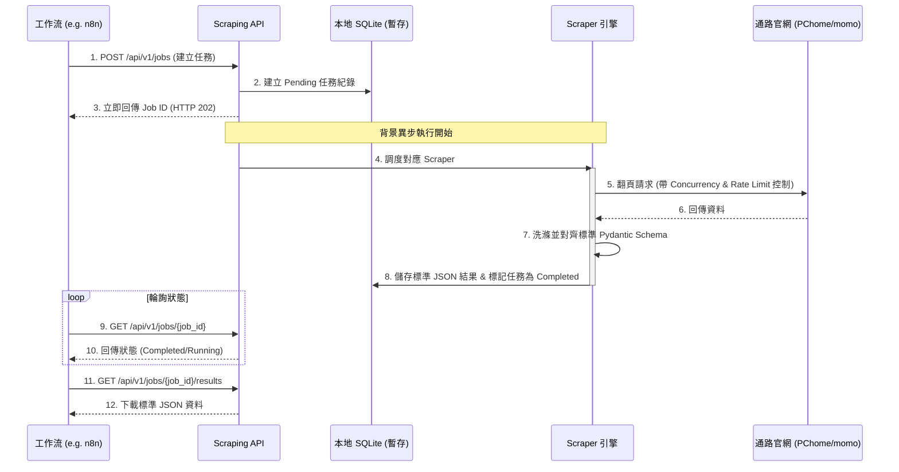

# 3C 市場情報自動化系統 - 資料蒐集服務說明書 (README)

本服務為 **Stateless-ish Scraping Service** + **Temporary Job Storage**。主要職責是高效、穩定且標準化地從各大 3C 通路爬取商品與新聞資訊，並將其格式化為標準 JSON，供下游工作流（如 n8n, Make, Airflow）進行歷史比對與分析。

---

## 1. 同步任務 vs. 異步任務 觀念解析

本系統同時提供**同步 (Sync)** 與**異步 (Async)** 兩種任務處理模式，以滿足不同業務場景的需求：

| 特性 | 同步任務 (Sync) | 異步任務 (Async) |
| :--- | :--- | :--- |
| **工作原理** | 發出請求後連線被「卡住 (阻塞)」，直到爬蟲在背後抓完並解析成功，才直接返回商品資料。 | 發出請求後，系統立即回傳一個 `job_id` 並中斷 HTTP 連線。爬蟲在後台默默抓取，完成後將 JSON 暫存在 SQLite 中。 |
| **超時風險** | 高。若爬取頁數多、因限速等待較久，HTTP 連線可能超時 (Timeout) 中斷。 | 無。因為連線早已釋放，即使任務爬取 10 分鐘也沒問題。 |
| **適合場景** | 開發除錯、即時單品查價。 | 每日自動化排程 (Cron)、大批量抓取（如抓取 100 筆商品）。 |
| **API 端點** | `POST /api/v1/scrape/sync` | `POST /api/v1/jobs` |
| **限制** | 最大抓取筆數限制為 **50 筆**。 | 無限制（但受限於平台防爬防禦上限）。 |

---

## 2. 如何使用（JSON 請求與回應範例）

### A. 使用「同步任務」 (Sync Scrape)
呼叫端點：`POST /api/v1/scrape/sync`

#### 1. 請求 JSON 範例 (Request)
```json
{
  "platform": "pchome",
  "category": "laptop",
  "keyword": "ASUS Zenbook",
  "limit": 2
}
```

#### 2. 回應 JSON 範例 (Response) - `HTTP 200 OK`
```json
[
  {
    "platform": "pchome",
    "brand": "Zenbook",
    "category": "laptop",
    "title": "Zenbook 14 OLED UX3405MA-0211G155H",
    "model": "DHAFTN-A900K79V7",
    "price": 38900,
    "original_price": 41900,
    "promotions": ["折價券折抵"],
    "stock_status": "in_stock",
    "url": "https://24h.pchome.com.tw/prod/DHAFTN-A900K79V7",
    "scraped_at": "2026-07-23T02:40:00.123456"
  },
  {
    "platform": "pchome",
    "brand": "Zenbook",
    "category": "laptop",
    "title": "Zenbook 14 (AMD) UM3406HA-0031B8840HS",
    "model": "DHAFTN-A900K79Q6",
    "price": 32900,
    "original_price": null,
    "promotions": [],
    "stock_status": "in_stock",
    "url": "https://24h.pchome.com.tw/prod/DHAFTN-A900K79Q6",
    "scraped_at": "2026-07-23T02:40:01.654321"
  }
]
```

---

### B. 使用「異步任務」 (Async Jobs)

#### 步驟 1：建立任務
呼叫端點：`POST /api/v1/jobs`

##### 1. 請求 JSON 範例 (Request)
與同步格式完全相同：
```json
{
  "platform": "momo",
  "category": "gpu",
  "limit": 5
}
```

##### 2. 回應 JSON 範例 (Response) - `HTTP 202 Accepted`
立即返回任務 ID，不阻塞等待：
```json
{
  "job_id": "job_02cebf166f56",
  "platform": "momo",
  "category": "gpu",
  "status": "pending",
  "progress": "0%",
  "error_message": null,
  "result_count": 0,
  "created_at": "2026-07-23T02:41:00.123456",
  "completed_at": null
}
```

#### 步驟 2：輪詢任務進度
呼叫端點：`GET /api/v1/jobs/job_02cebf166f56`

##### 回應 JSON 範例 (Response) - `HTTP 200 OK`
當狀態為 `running` 時，代表正在爬取：
```json
{
  "job_id": "job_02cebf166f56",
  "platform": "momo",
  "category": "gpu",
  "status": "running",
  "progress": "30%",
  "error_message": null,
  "result_count": 0,
  "created_at": "2026-07-23T02:41:00.123456",
  "completed_at": null
}
```
幾秒鐘後再次查詢，狀態變為 `completed`，代表抓取完成：
```json
{
  "job_id": "job_02cebf166f56",
  "platform": "momo",
  "category": "gpu",
  "status": "completed",
  "progress": "100%",
  "error_message": null,
  "result_count": 5,
  "created_at": "2026-07-23T02:41:00.123456",
  "completed_at": "2026-07-23T02:41:08.789123"
}
```

#### 步驟 3：獲取爬取到的 JSON 結果
呼叫端點：`GET /api/v1/jobs/job_02cebf166f56/results`

##### 回應 JSON 範例 (Response) - `HTTP 200 OK`
```json
[
  {
    "platform": "momo",
    "brand": "MSI",
    "category": "gpu",
    "title": "【MSI 微星】GeForce RTX 4060 Ti Ventus 2X Black 8G OC 顯示卡",
    "model": "12345678",
    "price": 11900,
    "original_price": 12500,
    "promotions": ["可使用折價券"],
    "stock_status": "in_stock",
    "url": "https://www.momoshop.com.tw/goods/GoodsDetail.jsp?i_code=12345678",
    "scraped_at": "2026-07-23T02:41:05.112233"
  }
  // ...(其他 4 筆商品)
]
```

---

## 3. 系統架構與流程

### 任務執行流程


---

## 4. 支援的平台與分類

本系統採用 **Adapter（適配器）設計模式**，平台爬取邏輯與 API 架構分離，目前支援：

| 平台代碼 (`platform`) | 品類限制 (`category`) | 資料類型 | 特點與翻頁機制 |
| :--- | :--- | :--- | :--- |
| **`pchome`** | `laptop`, `gpu`, `ssd`, `ram`, `monitor`, `phone` 等 | 商品資料 | 呼叫 PChome 前端 AJAX API。支援分頁（自動增量讀取 `page=1, 2...`）。 |
| **`momo`** | 同上 | 商品資料 | 解析 momo 嵌入之 Next.js App Router 狀態 JSON。支援分頁（自動讀取 `curPage=1, 2...`）。 |
| **`coolpc`** | `laptop`, `gpu`, `ssd`, `ram`, `monitor` | 商品報價 | 解析原價屋估價單的 `<select>` 選項，取得最新即時未稅報價。 |
| **`coolpc`** | **`news`** | 科技促銷新聞 | 抓取原價屋首頁促銷與新品新聞，解析發布日期與 200 字摘要。 |
| **`mobile01`** | `apple`, `phone`, `laptop`, `computer`, `camera` | 論壇貼文與內文摘要 | 穿透 Cloudflare 防爬保護，每版塊橫向遍歷 15 則。支援 `limit` 與動態/靜態降級機制。 |

---

## 5. 工程化流量控制與 WAF 穿透機制

為確保爬取服務在生產環境中不被目標通路與論壇封鎖 IP：

1. **獨立 Connection Pool**：每個 Scraper 適配器擁有自己的 `httpx.AsyncClient` 與 `limits=httpx.Limits(max_connections=5)`，重複使用 TCP 連線降低握手頻率。
2. **併發與限流限制**：
   - 每個適配器內部實作 `asyncio.Semaphore(concurrency)` 控制最大併發。
   - `min_interval`（如 momo 設定 1.5 秒）在每次請求發送前強制 sleep 計算，保證 QPS 低於安全閥值。
3. **Cloudflare WAF 物理 Session 旋轉重置 (Mobile01)**：
   - 每當進入下一個論壇子版塊前，主動**關閉並銷毀當前連線 Session**，重新建立擁有全新 TCP Port 與全新的 TLS/HTTP2 握手指紋的 `curl_cffi` 瀏覽器指紋連線，完全粉碎 Cloudflare 基於長連線的行為特徵追蹤。
   - 板塊間實作 `1.5s ~ 3.0s` 真人隨機延遲。
4. **自適應冷卻退避與容災降級**：
   - **限速自癒**：當偵測到連續 3 次擷取一樓摘要失敗時，自動判定為觸發 WAF 滑動頻率窗口警告，主動進行 15 秒深度冷卻休眠以重置阻擋。
   - **Fallback 降級快取**：為防止 Sitemap 在大流量下被 403 阻擋，內建大分類常用板塊靜態備份快取。一旦 `sitemap.php` 下載失敗，自動無縫降級載入本地快取，保證 QPS 異常下服務可用性依然為 **100%**。
5. **退避重試 (Tenacity)**：對 `HTTP 429` / `502` / `503` / `504` 等連線異常，執行 2s、4s、8s 的指數級退避重試，重試 3 次失敗後標記任務失敗。
